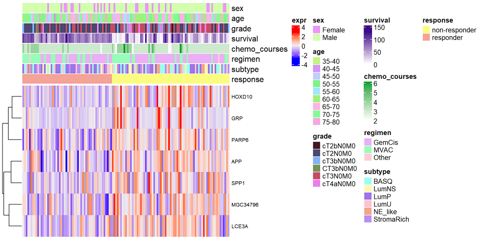
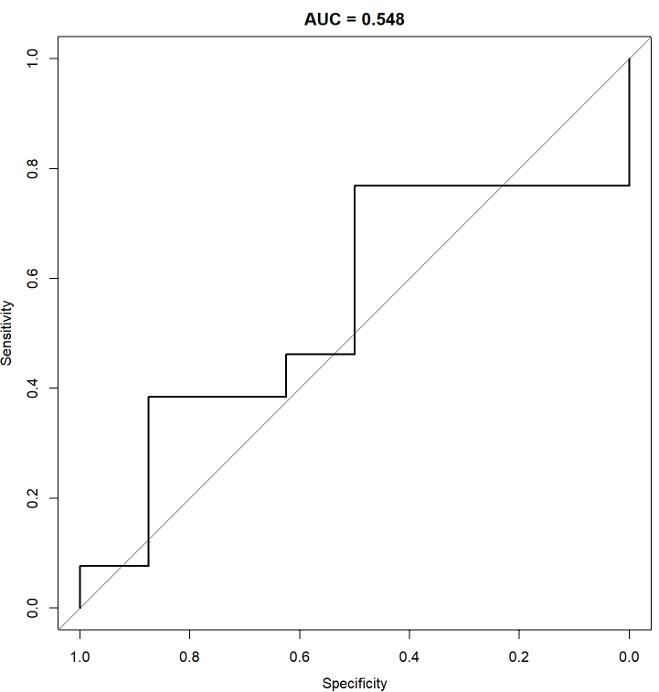
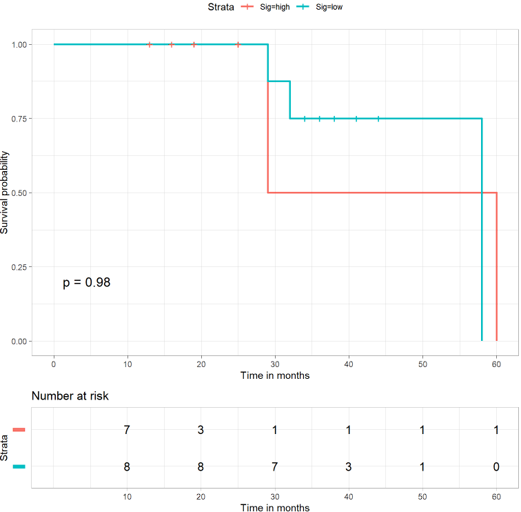

# Identifying Transcriptomic Biomarkers for Predicting Neoadjuvant Chemotherapy Response in Muscle-Invasive Bladder Cancer

[View full report on GitHub pages](https://philippeffer.github.io/MIBC_transcriptomic_biomarkers/)

## Background

The purpose of this project is to discover a transcriptomic biomarker capable of predicting whether a muscle-invasive bladder cancer (MIBC) patient’s tumor will respond to neoadjuvant chemotherapy (NAC). Cisplatin-based NAC followed by radical cystectomy is the standard of care for MIBC \[1\]. While NAC has been shown to improve survival in a subset of patients, not all derive significant benefit. Approximately 40-60% of patients are non-responders \[2\], exposing them to unnecessary toxicity, delays in surgery, and additional financial burdens without therapeutic benefit. A predictive biomarker could enable precision medicine, sparing non-responders from unnecessary treatment while allowing responders to proceed confidently with NAC, ultimately optimizing outcomes.

The significance of identifying a biomarker for NAC responsiveness in MIBC lies in its potential to transform clinical decision-making. Current practice relies on clinical and pathological factors, which lack the precision needed to predict NAC outcomes. The inability to stratify patients effectively often leads to suboptimal treatment pathways. By discovering a reliable biomarker, a critical gap would be filled in MIBC management. Such a biomarker would facilitate personalized therapy, reduce healthcare costs, and improve overall survival rates by ensuring timely and appropriate interventions.

Several large multi-institutional patient cohort studies have sought to elucidate the molecular characteristics associated with NAC responsiveness in MIBC. The Cancer Genome Atlas (TCGA) researchers performed a comprehensive molecular characterization of MIBC and identified five expression-based subtypes with potential therapeutic implications, shown below \[1\]  

Fig. 1\. Expression-based subtypes identified by TCGA researchers. Figure 7 from Robertson et al. \[1\]

Based on their preliminary data, they suggested that tumors of the Luminal-papillary and Luminal-infiltrated subtypes may be resistant to cisplatin-based chemotherapy, while the Basal/Squamous and Neuronal subtypes may be more responsive \[1\]. Seiler et al. (2017) explored the utility of molecular signatures in predicting NAC outcomes, offering promising yet preliminary data on biomarkers for response prediction \[2\]. Taber et al. (2020) employed multi-omics analysis to reveal molecular correlates of cisplatin sensitivity, finding that both immune infiltrated and excluded subtypes, as well as elevated PD-1 protein expression were all associated with cisplatin chemotherapy response in MIBC \[3\]. Most recently, Sjödahl et al. (2022) further demonstrated variability in NAC responses across immunohistochemistry (IHC) and transcriptomic subtypes, emphasizing the clinical relevance of subtype-specific biomarkers \[4\]. Collectively, these studies underscore the potential for transcriptomic biomarkers to enhance treatment precision but also highlight the need for further validation and clinical translation.

The ideal result of this project would be to develop a clinically applicable biomarker assay that could be seamlessly integrated into diagnostic workflows. This assay would guide oncologists in selecting patients likely to benefit from NAC, thereby personalizing treatment strategies. In the long term, such a biomarker could serve as a cornerstone for broader efforts to stratify therapies in bladder cancer and potentially other malignancies treated with cisplatin-based NAC.

## Dataset

The data available from the Sjödahl et al. (2022) study mentioned above (GEO: [GSE169455](https://www.ncbi.nlm.nih.gov/geo/query/acc.cgi?acc=GSE169455)) was used for the biomarker discovery and model training portion of this project, as it includes a well-defined cohort of MIBC patients treated with cisplatin-based NAC \[4\]. This dataset specifically focuses on MIBC patients undergoing NAC, providing a focused context for predictive biomarker development. Additionally, the Taber et al. (2020) dataset (available as [Supplementary Data 4](https://www.nature.com/articles/s41467-020-18640-0#Sec30) on the article page) was used for independent model validation to assess the robustness of the discovered biomarker across different cohorts.

The Sjödahl dataset comprised a total cohort of 172 patients receiving preoperative cisplatin-based chemotherapy and 239 controls who underwent radical cystectomy without perioperative chemotherapy. For this project, analysis was restricted to the 125 NAC-treated patients, ensuring the data was both relevant and of sufficient size for biomarker discovery. Gene expression data for this dataset was generated from high-quality RNA extracted from tumor tissue using the Affymetrix Gene ST 1.0 microarray platform, which provides robust transcriptomic profiling. The dataset was pre-processed: the expression data utilized had been normalized, adjusted for labeling batch effects using ComBat, and summarized by gene symbol by the study authors. Patient phenotype data was available in a supplementary spreadsheet to the paper ([Supplementary data 2](https://www.sciencedirect.com/science/article/pii/S0302283821021382?via%3Dihub#s0090)). Pathological response in each cystectomy specimen was evaluated by a physician, assigned an American Joint Committee on Cancer's (AJCC) Post Therapy Path (yp) Pathological Response stage, and each sample was labeled as a non-responder (“no pR”; AJCC yp≥T2 or ypN+), a partial responder (“pPR”; AJCC ypT1N0, ypTaN0, or ypTisN0), or a complete responder (“pCR”; AJCC ypT0N0) to the NAC.

The Taber dataset, used for validation, initially consisted of 300 bladder cancer patients receiving chemotherapy. Following filtering for MIBC patients treated with cisplatin-based NAC that also had complete gene expression and treatment response data, 21 samples remained. Although smaller in size, the dataset was suitable for independent validation, offering a valuable external test of the biomarker’s predictive power. Gene expression was generated using bulk RNA sequencing with the QuantSeq FWD HT kit and Illumina NextSeq 500, ensuring high resolution and reliability. Patient clinicopathological and treatment data were available as Supplementary Data 1, while patient survival statistics were available in a spreadsheet in the “Source data” file attached to the paper. Patients were labeled as responders/non-responders with NAC response defined as pathological downstaging to stages \<CIS, Ta or T1 based on the pathological examination on the cystectomy specimen. While this NAC response classification is not identical to that used in the Sjödahl study, it is very close when the partial and complete response categories used by Sjödahl are condensed into a single “responder” class.

Both datasets originate from credible, peer-reviewed research published in high-impact journals. Sjödahl et al. (2022) published their work in European Urology, a leading journal in the field, while Taber et al. (2020) appeared in Nature Communications, an esteemed multidisciplinary journal. The authors of both studies are recognized experts in bladder cancer research, further underscoring the credibility of these resources.

Both datasets were generated from studies adhering to ethical guidelines for human research, as approved by institutional review boards (IRBs). Patients in both cohorts provided informed consent for the use of their tumor samples and clinical data in research. In addition, all data was de-identified, ensuring the privacy and confidentiality of participants. The secondary use of these datasets for biomarker discovery aligns with ethical research practices and promotes scientific advancement in personalized oncology.

## Methods

The methods employed in this project were carefully selected to identify transcriptomic biomarkers predictive of response to neoadjuvant chemotherapy (NAC) in muscle-invasive bladder cancer (MIBC). The workflow integrated differential gene expression analysis, pathway enrichment analysis, gene co-expression network analysis, single-sample gene set enrichment analysis (ssGSEA), and machine learning-based classification. Each method is described below in detail, along with its implementation and the tools used for analysis.

<ins>Differential Gene Expression Analysis</ins>

Differential gene expression analysis was conducted on the pre-processed Sjödahl microarray dataset including 125 patients treated with cisplatin-based NAC, in order to identify genes significantly associated with NAC response. The partial responders and complete responders were combined into a single “responder” group for this project, and differential gene expression analysis between the responder/non-responder groups was conducted using the significance analysis of microarrays (SAM) R package (samr v3.0). The SAM method applied a two-class unpaired t-test to identify differentially expressed genes (DEGs) between the two groups. To control for multiple hypothesis testing, a null distribution was generated using 100 permutations, and a false discovery rate (FDR) threshold of 0.05 was applied to identify significant genes.

<ins>Gene Set Overlap Analysis</ins>

To further interpret the biological relevance of the identified DEGs, gene set overlap analysis was performed using the GSEA-MSigDB web tool (MSigDB v2024.1.Hs), focusing on the Hallmark gene sets. The DEGs were analyzed for enrichment with a q-value FDR cutoff of 0.05 to determine significantly overrepresented biological pathways and molecular processes.

<ins>Weighted Gene Co-expression Network Analysis (WGCNA)</ins>

WGCNA was applied to explore co-regulated gene modules potentially associated with NAC response. Using the top 1000 genes with the highest variance in expression across the Sjödahl dataset, a gene co-expression network was constructed with the WGCNA R package (v1.73). The modules identified were then correlated with patient pathological response using the WGCNA weighted Pearson correlation algorithm, and statistical significance was assessed using the Student asymptotic p-value with a cutoff of 0.05.

<ins>Single-sample Gene Set Enrichment Analysis (ssGSEA) and Survival Analysis</ins>

ssGSEA was conducted using the singscore Bioconductor package (v1.24.0). An enrichment score for the identified DEGs was calculated for each patient based on their individual gene expression rank profile. Patients were stratified into high biomarker activity and low biomarker activity groups, defined as the top and bottom 35% of biomarker signature scores. To assess whether the DEG biomarker was associated with survival outcomes, cancer-specific survival (CSS) between these two biomarker activity groups was assessed using Kaplan-Meier survival analysis, and statistical differences were evaluated by log-rank test, utilizing the R survival package (v3.7.0).

<ins>Predictive modeling</ins>

A random forest (RF) classifier was developed to predict NAC response based on the DEG biomarker identified in the discovery cohort. The expression levels of the biomarker genes were z-score standardized prior to training the RF model using the randomForestSRC R package (v3.3.1). Model performance was assessed using accuracy, sensitivity, specificity, and area under the receiver-operator characteristic curve (ROC-AUC). To assess robustness, 5-fold cross-validation was performed.

<ins>Biomarker validation</ins>

The Taber et al. RNA-seq dataset was used for independent validation of the random forest model. After filtering for patients receiving cisplatin-based NAC with complete gene expression and response data, 21 samples were retained. Two DEGs from the biomarker were excluded from the validation analysis due to dataset limitations. The validation RNA-seq expression data was z-score standardized for compatibility with the microarray expression levels of the discovery set, and the reduced RF model was applied to the validation cohort, assessing its predictive performance using accuracy, sensitivity, specificity, and ROC-AUC. Additionally, ssGSEA was performed on the validation dataset using the same DEG-based gene signature, and survival analysis was conducted to evaluate differences in cancer-specific survival between high-risk and low-risk groups, as described for the discovery cohort.

## Results

This study identified a biomarker signature comprising seven genes that were differentially expressed between responders and non-responders to neoadjuvant chemotherapy (NAC) in muscle-invasive bladder cancer (MIBC). These genes—HOXD10, APP, PARP6, SPP1, MGC34796, LCE3A, and GRP—were all significantly up-regulated in non-responder tumors. No genes were found to be significantly down-regulated.  
  
Fig. 2\. Heatmap of DEG expression with columns grouped by response status

Gene set enrichment analysis of the DEGs revealed significant overlap with the Hallmark Angiogenesis gene set (q-value 5.2e-4), implicating angiogenesis as a potential process underlying resistance to NAC. Notably, SPP1 and APP are components of this pathway, which may suggest their roles in mediating tumor microenvironment changes unfavorable to chemotherapy response.

Weighted Gene Co-expression Network Analysis (WGCNA) identified six co-expression modules, one of which showed the strongest, albeit non-significant, correlation (r=0.11, p=0.22) with pathological response. This module was enriched in genes associated with epithelial-mesenchymal transition, apical junctions, coagulation, UV response, apoptosis, and angiogenesis. However, there was no overlap between the genes in this module and the seven DEGs identified, indicating that the biomarker signature derived from differential expression may reflect a distinct biological mechanism.

The biomarker's biological relevance was further assessed through single-sample gene set enrichment analysis (ssGSEA) and survival analysis. In the Sjödahl discovery cohort, patients stratified by biomarker ssGSEA score showed a significant difference in cancer-specific survival (CSS) (p=0.00033). Approximately 75% of patients in the low biomarker activity group survived five years (60 months), compared to only \~40% in the high biomarker activity group. These results suggest that higher expression of the biomarker genes is associated with poorer prognosis, consistent with their upregulation in NAC non-responders.

A random forest classifier trained on the discovery cohort used the biomarker genes to predict NAC response, with PARP6 emerging as the most critical feature to the model, contributing nearly twice as much to model accuracy as the next most important gene, MGC34796. The classifier achieved an average accuracy of 75%, sensitivity of 82%, specificity of 68%, and an area under the receiver-operator characteristic curve (AUC) of 0.75 during five-fold cross-validation.

| Discovery Dataset | Validation Dataset |
| ----- | ----- |
| A | B  |

Fig. 3\. ROC curves for response prediction performance in the discovery cohort (A) and the validation cohort (B)

Validation of the biomarker and model was performed using the Taber et al. RNA-seq cohort. Two genes from the biomarker had to be excluded—MGC34796 due to its absence from the validation dataset and LCE3A due to zero variance, which prevented z-score standardization. The reduced biomarker signature of five genes achieved a classification accuracy of 67%, sensitivity of 77%, specificity of 50%, and AUC of 0.55. Survival analysis using the remaining biomarker signature in the validation cohort showed no significant difference in CSS between high and low biomarker activity groups (p=0.98).

| Discovery Dataset | Validation Dataset |
| ----- | ----- |
| A  | B  |

Fig. 4\. Kaplan-Meier curves comparing survival in high and low biomarker activity patient groups in the discovery cohort (A) and the validation cohort (B)

These findings indicate that the biomarker signature demonstrated strong predictive and prognostic utility within the discovery cohort but failed to generalize to the independent validation cohort. The lack of significant survival differences and the reduced model performance highlight potential overfitting, suggesting that the biomarker may not be robust across diverse datasets.

The therapeutic potential of targeting individual genes in the biomarker was also considered. PARP6, as the most influential gene in the random forest model, is of particular interest due to the availability of PARP inhibitors that target other members of the PARP family. However, there are no specific drugs currently targeting PARP6. The roles of SPP1 and APP in angiogenesis suggest they may be indirectly targetable through anti-angiogenic therapies, such as VEGF inhibitors.

## Discussion

The findings of this study highlight both the potential and the limitations of using transcriptomic biomarkers to predict neoadjuvant chemotherapy (NAC) response in muscle-invasive bladder cancer (MIBC). The identified biomarker, which includes genes such as SPP1, HOXD10, and PARP6, mirrors the differential expression patterns reported by Sjödahl et al. However, like their study, the biomarker failed to demonstrate robust predictive value in independent datasets, underscoring the challenges of biomarker generalizability.

A key limitation of this analysis is the lack of incorporation of existing MIBC molecular subtype classifications. Subtypes have distinct transcriptomic landscapes, and stratifying patients by subtype, as done in Sjödahl et al., might reveal subtype-specific predictive biomarkers or enhance the predictive accuracy of the current biomarker. Additionally, this study did not account for the tumor microenvironment. Immune and stromal cell infiltration can influence chemotherapy response, and future research could leverage tools such as CIBERSORT or ESTIMATE to analyze these components. Another potential avenue for improvement is the incorporation of epigenetic data, such as DNA methylation, into a multi-omics approach. Combining transcriptomic data with epigenetic modifications could reveal regulatory mechanisms underlying gene expression changes and provide a more comprehensive view of chemotherapy response.

Moreover, the small size of the validation dataset limited the power to assess the biomarker’s predictive value. Expanding validation to include larger, multi-center cohorts with consistent gene expression and multi-omics data would strengthen conclusions about the biomarker’s generalizability and clinical utility.

Despite these limitations, this analysis could contribute to the understanding of molecular mechanisms underlying chemotherapy resistance in MIBC. The potential role of SPP1 and APP in angiogenesis and the importance of PARP6 as a key contributor to predictive models suggest potential therapeutic targets for improving patient outcomes. Future research integrating molecular subtype data, tumor microenvironment profiles, epigenetic modifications, and larger cohorts could enhance biomarker discovery and clinical applicability. Broadly, these findings underscore the complexity of chemotherapy response in MIBC and highlight the need for personalized therapeutic approaches in this heterogeneous disease.

## References:

1. Robertson AG, Kim J, Al-Ahmadie H, et al. (2017). Comprehensive Molecular Characterization of Muscle-Invasive Bladder Cancer. Cell. 2017 Oct 19;171(3):540-556.e25. doi: [10.1016/j.cell.2017.09.007](https://doi.org/10.1016/j.cell.2017.09.007).  
2. Seiler R, Ashab H.A.D., Erho N, et al. (2017). Impact of molecular subtypes in muscle-invasive bladder cancer on predicting response and survival after neoadjuvant chemotherapy. Eur Urol, 72 pp. 544-554. doi: [https://doi.org/10.1016/j.eururo.2017.03.030](https://doi.org/10.1016/j.eururo.2017.03.030)  
3. Taber, A., Christensen, E., Lamy, P. et al. (2020). Molecular correlates of cisplatin-based chemotherapy response in muscle invasive bladder cancer by integrated multi-omics analysis. Nat Commun 11, 4858\. [https://doi.org/10.1038/s41467-020-18640-0](https://doi.org/10.1038/s41467-020-18640-0)  
4. Sjödahl G, Abrahamsson J, Holmsten K, et al. (2022) Different Responses to Neoadjuvant Chemotherapy in Urothelial Carcinoma Molecular Subtypes. Eur Urol. 81(5):523-532. doi: [10.1016/j.eururo.2021.10.035](https://doi.org/10.1016/j.eururo.2021.10.035).  
5. H.B. Grossman, J. Bellmunt, P.C. Black. (2019). Can biomarkers guide the use of neoadjuvant chemotherapy in T2 bladder cancer? Eur Urol Oncol, 2, pp. 597-602. Doi: [https://doi.org/10.1016/j.euo.2019.06.002](https://doi.org/10.1016/j.euo.2019.06.002)

## Supplementary Data:

| Gene ID | Gene Name | Fold Change | q-value |
| :---: | :---: | :---: | :---: |
| HOXD10 | homeobox D10 | 1.167 | 0 |
| APP | amyloid beta precursor protein | 1.059 | 0 |
| PARP6 | poly(ADP-ribose) polymerase family member 6 | 1.054 | 0 |
| SPP1 | secreted phosphoprotein 1 | 1.131 | 0 |
| MGC34796 | sepiapterin reductase (7,8-dihydrobiopterin:NADP+ oxidoreductase) pseudogene | 1.057 | 0 |
| LCE3A | late cornified envelope 3A | 1.041 | 0 |
| GRP | gastrin releasing peptide | 1.091 | 0 |

Supplementary Table 1: List of all biomarkers discovered